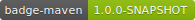

Ce plugin maven est inspiré de
https://github.com/QualInsight/qualinsight-plugins-sonarqube-badges

      <plugin>
        <artifactId>badge-maven-plugin</artifactId>
        <version>1.0.O-SNAPSHOT</version>
        <configuration>
          <outputDir>${project.basedir}/target/site/resources/</outputDir>
          <badges>
            <badge>
              <name>badge-maven</name>
              <version>1.0.O-SNAPSHOT</version>
              <color>GREEN</color>
            </badge>
          </badges>
        </configuration>
      </plugin>

      
